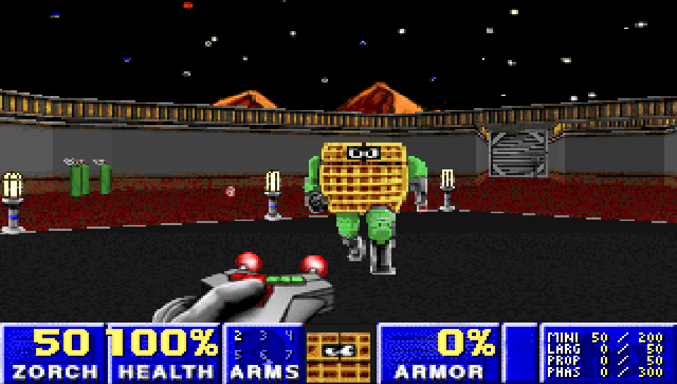
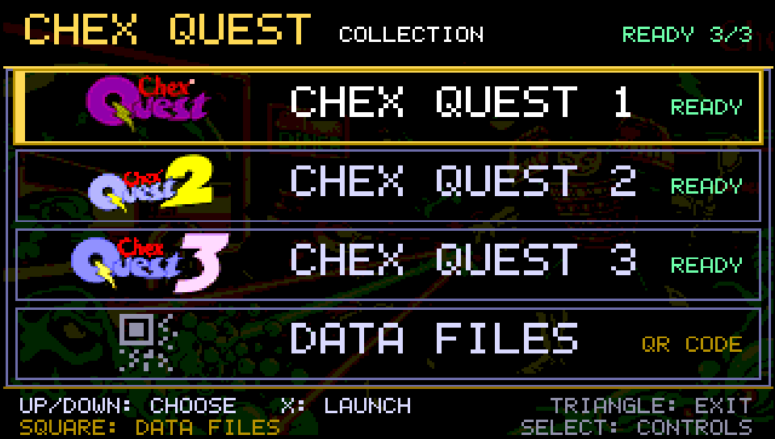
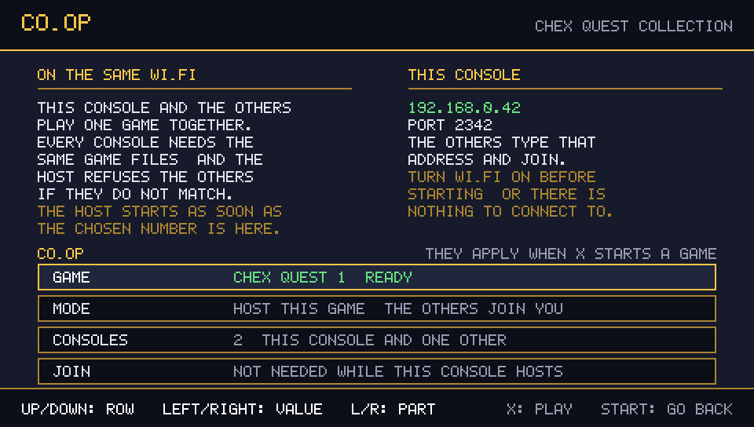
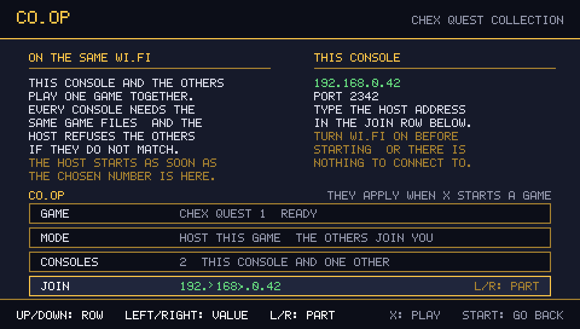
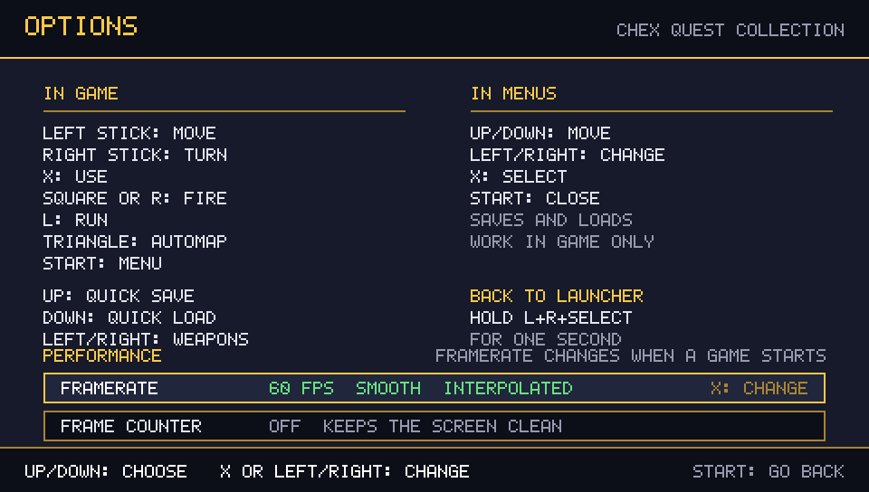
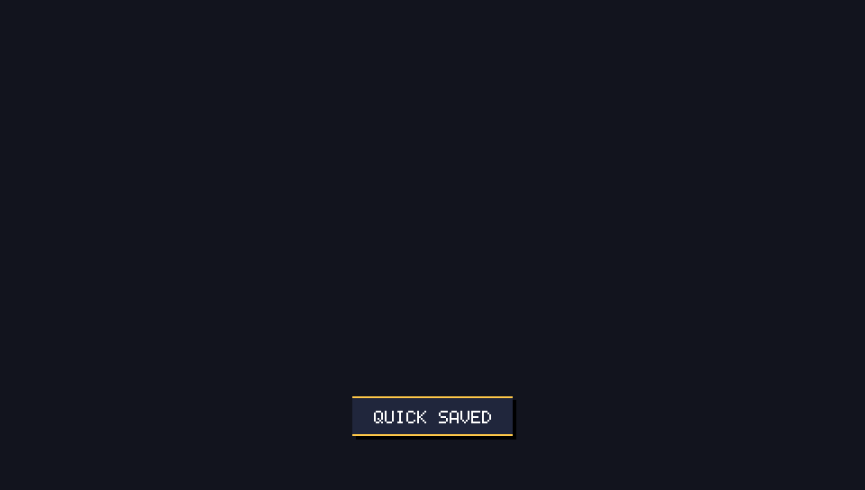
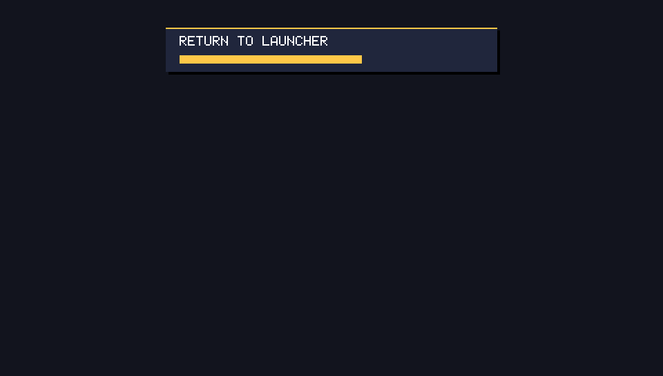
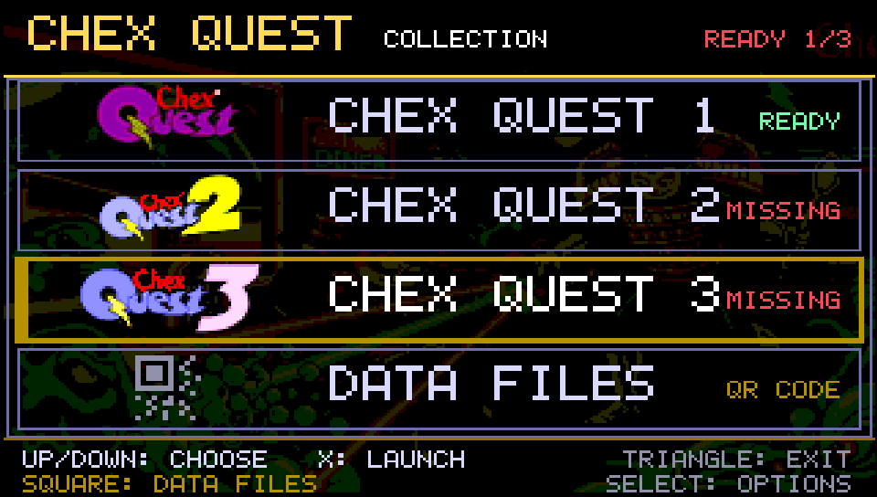
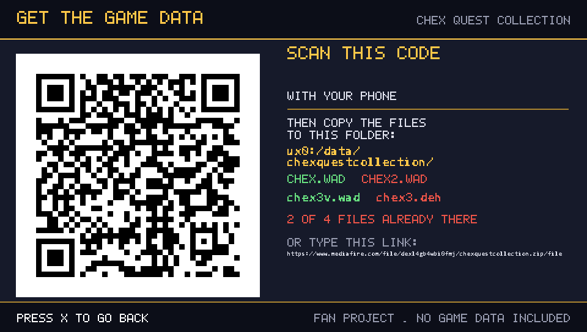
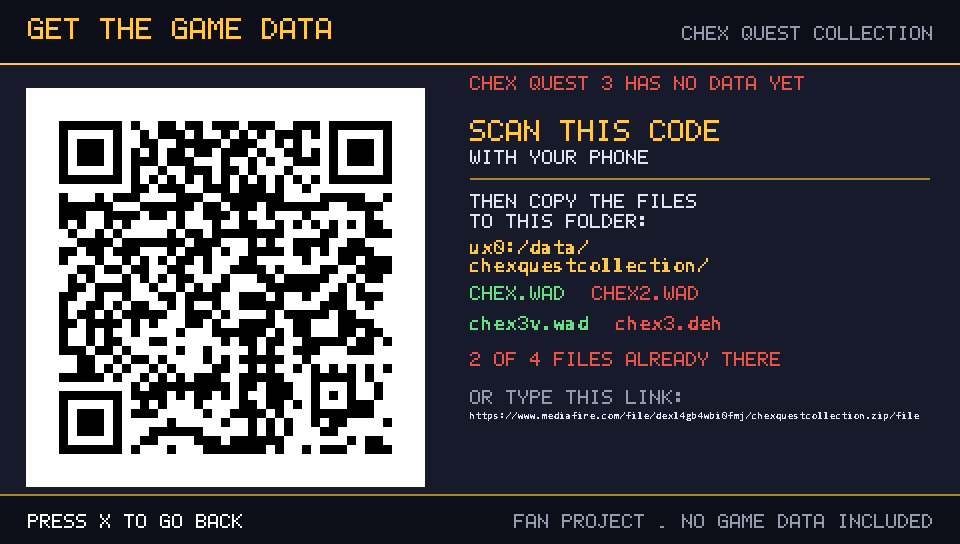

# Chex Quest Collection — PS Vita

One Vita app for **Chex Quest 1**, **Chex Quest 2** and **Chex Quest 3: Vanilla Edition**. Pick a game in the launcher and press **Cross** or **START** to play it: the games run at **60 frames per second** with a smooth, interpolated view, and **two to four consoles can play one game together over Wi-Fi**.

## Version 2.0 — the final release

**2.0 is the last update of this project**, and it is the release the whole tree has been building towards: the games draw at 60 fps, co-op works between consoles on the same router, and the launcher handles the game data on its own. Everything below ships in this version.

**Co-op over the LAN (new).** Two to four consoles on the same Wi-Fi play one game together. The **CO-OP** screen (**R** in the launcher) picks the game, **HOST THIS GAME** or **JOIN ANOTHER CONSOLE**, how many consoles take part, and the address to join — typed once with the pad and remembered afterwards. The host starts the game by itself as soon as everyone is connected, every console is checked against the others' game data before the level loads, and a session that cannot start says so and returns to the launcher instead of leaving a black screen. Nothing leaves your network: no account, no master server, no listing. Full details [below](#co-op).

A co-op session on two consoles, the host's screen:



**60 frames per second (new).** The picture is drawn once per vertical blank and interpolated between the last two game tics, and it is presented double buffered, so turning the view neither steps at 35 Hz nor tears. The simulation keeps Doom's fixed 35 Hz timestep, so nothing about the game itself changed: the camera, monsters, projectiles, items, the weapon sway and the sector heights — **doors, lifts and moving floors** — are the ones interpolated.

**Pacing you can pick, and a guard that keeps it honest (new).** The **OPTIONS** screen offers **60 FPS** (default), **30 FPS** (half the frames to draw, for the heaviest maps) and **35 FPS (classic)**, plus **AUTO SPEED**, which drops to 30 fps for the session when a scene genuinely cannot hold 55 fps, and a **FRAME COUNTER** in the corner.

**The launcher.** A proper menu: the three games plus a **DATA FILES** row, each game showing at a glance whether it is ready, menu music and blips, and the co-op and options screens. When a file is missing it does not fail: it opens a screen with a **QR code** for the game data, the folder to copy it into, and a live checklist that updates while you FTP the files across.

**Quick save and quick load.** **D-pad Up** and **D-pad Down** in game, with a short on-screen confirmation ("QUICK SAVED", "QUICK LOADED", "NO QUICK SAVE YET"). Saves and settings are kept separately per game.

**Back to the launcher without rebooting.** **Hold L + R + SELECT for one second** while playing: a progress bar fills and the app reloads into the launcher.

**Artwork that fits the Vita.** The launcher layers, the LiveArea background, the startup image and the bubble icon are generated from the artwork sources by the scripts in `scripts/`, and the icon is painted on the banner's own background colour, so no black band appears around it on the home screen.

**The contract tests run on every build (new).** The GitHub Actions workflow builds the VPK and runs the test suite, so a broken data file name, a moved save path or a staged WAD fails the build instead of reaching a console.

| Launcher | Co-op: hosting | Co-op: joining |
|---|---|---|
|  |  |  |

| Options | Quick save | Return to launcher |
|---|---|---|
|  |  |  |

## Screenshots

| Launcher | Game data missing |
|---|---|
|  |  |

| Data files and QR code | Data screen, nothing installed yet |
|---|---|
|  |  |

| Options and controls | Return to launcher | Quick save |
|---|---|---|
|  |  |  |

| Co-op: hosting | Co-op: joining |
|---|---|
|  |  |

| Co-op in game |
|---|
|  |

## Download and install

Get [`ChexQuestCollection.vpk`](https://github.com/SancioPanza88/chex-quest-collection/releases/latest/download/ChexQuestCollection.vpk) from Releases and install it on a homebrew-enabled PS Vita/PSTV (VitaShell, or any VPK installer). Version 2.0 is the final release of the collection.

## Installation and game data

The VPK contains the launcher, **not** the game data. Copy your legally obtained files directly into `ux0:/data/chexquestcollection/`:

- `CHEX.WAD`
- `CHEX2.WAD`
- `chex3v.wad` and `chex3.deh`

**Important:** put all the files together in the `chexquestcollection` folder itself. Do **not** create subfolders (for example `chexquestcollection/chexquest/` or `chexquestcollection/chex3/`): the launcher will not find files placed inside subfolders.

Expected layout:

```
ux0:/data/chexquestcollection/
├── CHEX.WAD
├── CHEX2.WAD
├── chex3v.wad
└── chex3.deh
```

If files are missing, the launcher says so instead of failing:

- every game row shows **READY** or **MISSING**, and the header counts the installed games (`READY 2/3`);
- selecting the **DATA FILES** row (or pressing **Square**, or pressing **Cross** on a game that has no data yet) opens a screen with a **QR code** to download the data archive with your phone, a printable link, the folder to copy the files into, and a live checklist of the four files;
- when the launcher starts with no game data at all, it opens that data screen first;
- the status list is re-checked once per second, so files copied over FTP show up without restarting the app.

These are the three games the collection supports. **Chex Quest 4: Escape from
Bazoik**, the fan demo, is not one of them: it is a GZDoom mod (UDMF maps,
compiled ACS scripts, DECORATE actors) and this app's engine cannot read any of
that, so there is no way to add it as a fourth entry.

## PS Vita controls

The D-pad works in the Doom menus too, and every action is the same in all three games.

| In game | |
|---|---|
| Left stick | move |
| Right stick | turn |
| Cross | use |
| Square or R | fire |
| L | run |
| Triangle | automap |
| START | menu |
| D-pad Up | quick save |
| D-pad Down | quick load |
| D-pad Left/Right | cycle weapons (hold to repeat) |

| In menus | |
|---|---|
| D-pad Up/Down | move |
| D-pad Left/Right | change value |
| Cross | select |
| START | close |

Quick saves and loads confirm themselves with a short on-screen message ("QUICK SAVED", "QUICK LOADED", or "NO QUICK SAVE YET"). Saves and settings are kept separately for each game, under `ux0:/data/chexquestcollection/saves/<game>/` and `cfg/<game>/`.

To leave a game and go back to the launcher, **hold L + R + SELECT for one second**: a progress bar fills up and the app reloads into the launcher.

## Co-op

Two to four consoles on the same Wi-Fi can play one game together. Press **R** in
the launcher to open the **CO-OP** screen: pick the game, pick **HOST THIS GAME**
or **JOIN ANOTHER CONSOLE**, say how many consoles are taking part, and when you
are joining, type the address of the console that hosts. **X** starts.


**UP/DOWN** chooses a row, **LEFT/RIGHT** changes its value. On the **JOIN** row
the shoulders pick which part of the address is being changed (**L/R: PART**,
shown as `192.<168>.0.1`) and left/right step that part up and down, repeating
while held. **The first three parts come from this console's own address**, which
is what a home router hands out, so usually only the last part has to be typed —
and only once: the address is remembered from then on.

The right column shows **this console's own address** and the port (**2342**).
Read that address out to the other player, who types it into the **JOIN** row.
The role, the game, the number of consoles and the address are all stored in
`settings.cfg`, so an address is typed once: after that, a session is pressing
**R** and then **X** on both consoles.

- **The host starts the game by itself**, as soon as the number of consoles you
  chose is connected. There is no key to press, so while it waits it shows how
  many are in (`2 OF 2 CONSOLES IN`).
- **Every console needs the same game files.** The consoles compare the
  checksums of their game data and refuse to start when they do not match,
  instead of starting a game that would fall out of step: the console says
  `DIFFERENT GAME DATA` and goes back to the launcher.
- **A co-op game that cannot start says so.** If the other console leaves while
  everyone is still waiting, the console shows `LOST THE OTHER CONSOLE` and
  reloads into the launcher, instead of starting a game with nobody in it.
- **Co-operative, not deathmatch**: one shared level, one player per console.
  There is no second input on a single console, so this is a LAN feature.
- **Chex Quest 2's own levels carry no co-op starts.** The game was finished in
  a hurry and its maps have room for a single player, so in co-op the other
  consoles spawn on player 1's start and push apart as soon as the game runs.
  Chex Quest 1 and Chex Quest 3 carry proper cooperative starts and are not
  affected.
- **The level is already running when you get there.** The host started it as
  soon as everyone connected, so opening the game's menu and picking **NEW GAME**
  answers *you can't start a new game while you're in a network game*: that is
  the engine refusing, as it should, not a fault. Saving is off in co-op too.
- **Nothing leaves your network.** The console hosts the game itself and the
  others connect straight to its address: no account, no server, no listing.
- Playing alone is exactly as before: leave the co-op screen with **START** and
  the launcher starts a normal single player game.

While waiting for the other consoles, **hold L + R + SELECT for a second** to go
back to the launcher.

## Framerate

The picture is presented double buffered — two framebuffers exchanged at the vertical blank — so the frame being scanned out is never overwritten and turning the view does not tear the image.

Games draw at **60 fps** by default. The simulation still runs on Doom's fixed 35 Hz timestep, so the frame you see is interpolated between the last two tics: movement and turning, monsters, projectiles, items, the weapon sway and the sector heights — **doors, lifts and moving floors** — are all continuous instead of stepping 35 times per second, at the cost of the picture being one tic (about 28 ms) behind the input. A jump longer than a single tic of movement, like a teleport or a spawn, is never interpolated, so nothing smears across the map. **AUTO SPEED**, the automatic speed guard, is described above.

## Automatic speed guard

The **OPTIONS** screen (**SELECT** in the launcher) is a menu of three boxed rows: **UP/DOWN** chooses a row, **X** or left/right changes its value. Everything it sets is stored in `ux0:/data/chexquestcollection/settings.cfg` and applies the next time you start a game; the screen also lists the full control mapping.

**FRAMERATE** picks how the picture is paced:

- **60 FPS** (default) — one frame per vertical blank with the interpolated view.
- **30 FPS** — one frame every other vertical blank. Half the frames to draw leaves the console the headroom the heaviest maps need, at the cost of a less fluid picture.
- **35 FPS (classic)** — one frame per game tic, exactly like the original engine and the most direct feel.

**AUTO SPEED** (on by default) is the guard that keeps 60 fps honest. It measures the frames actually presented, and if two whole seconds in a row land below 55 fps — a scene that does not fit — the port drops to 30 fps for the rest of the session and says so on screen with **AUTO SPEED: 30 FPS**. A second in which the loop barely ran at all, like a level load or a screen wipe, is not counted: 30 frames would not have fixed that. The framerate you chose in the menu is not overwritten: it is the value saved to `settings.cfg`, and picking a framerate by hand cancels the drop.

**FRAME COUNTER** turns on a counter in the bottom left corner while you play, showing the frames per second and the average frame time of the last second.

## Build

Install VitaSDK, then run:

```sh
cmake -S . -B build -DCMAKE_TOOLCHAIN_FILE="$VITASDK/share/vita.toolchain.cmake"
cmake --build build --parallel 1
```

The contract tests check the launcher and data contracts against the sources:

```sh
python -m unittest discover -s tests
```

The screenshots above are rendered by `scripts/prepare_screenshots.py`, which reads
the font, the colours and the coordinates back out of `doomgeneric_vita.c` and
refuses to write a screen whose texts would overlap.

Game data and third-party trademarks/artwork remain the property of their respective owners; this project does not distribute WAD or DEH files.
