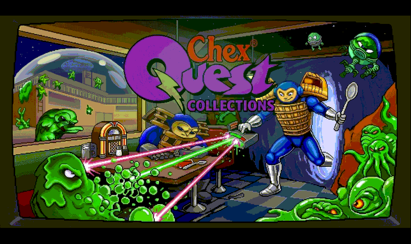

# Chex Quest Collection — PS Vita

A native PS Vita launcher and port for **Chex Quest 1**, **Chex Quest 2**, and **Chex Quest 3: Vanilla Edition**. The launcher uses the supplied collection backdrop and an individual logo for each game; move the white highlight with the D-pad and press **Cross** or **START**. To switch games, close the app and launch the Collection again.

<p align="center">
  
</p>

<p align="center"><em>Chex Quest Collection artwork for PS Vita.</em></p>

<p align="center">
  
</p>

<p align="center"><em>Gameplay screenshot from the original PS Vita port.</em></p>

> This repository and its VPK contain code and artwork only. You must provide game data from a legitimate copy. Copyrighted WAD and DEH files are not included or distributed here.

## Installation and game data

Install the VPK on a PS Vita/PSTV with a compatible homebrew setup. Copy your legally obtained game files to these locations on the Vita:

| Game | Required files |
| --- | --- |
| Chex Quest 1 | `ux0:/data/chexquestcollection/CHEX.WAD` |
| Chex Quest 2 | `ux0:/data/chexquestcollection/CHEX.WAD` and `ux0:/data/chexquestcollection/CHEX2.WAD` |
| Chex Quest 3: Vanilla Edition | `ux0:/data/chexquestcollection/chex3v.wad` and `ux0:/data/chexquestcollection/chex3.deh` |

Chex Quest 2 loads `CHEX2.WAD` as a PWAD over the original Chex Quest IWAD. The CQ3 Vanilla Edition requires its DEH patch. Keep the exact filenames shown above.

## PS Vita controls (shared by all three games)

| Action | PS Vita control |
| --- | --- |
| Move / walk | Left analog stick |
| Turn | Right analog stick |
| Quick-save (slot 0) | D-pad Up |
| Quick-load (slot 0) | D-pad Down |
| Previous / next weapon | D-pad Left / Right; hold to cycle |
| Select weapon 1–7 | Tap the matching section of the front touchscreen's top edge |
| Fire | **Square** or **R** |
| Use / open doors | **Cross** |
| Run | **L** |
| Strafe modifier | **Circle** + left analog stick |
| Automap | **Triangle** |
| In-game menu | **START** |
| Confirm in menus | **SELECT** |

The D-pad has the same functions in every game: **Up saves**, **Down loads**, and **Left/Right cycle weapons**. Use the left analog stick for movement. Quick-save/load are available during a level; Down loads slot 0 only when a save exists.

Save games and settings are kept separately for each title in `ux0:/data/chexquestcollection/saves/cq1`, `cq2`, `cq3` and `cfg/cq1`, `cq2`, `cq3`. Diagnostic log: `ux0:/data/chexquestcollection/debug.log`.

## Build

Build with VitaSDK and CMake:

```sh
cmake -S . -B build -DCMAKE_TOOLCHAIN_FILE="$VITASDK/share/vita.toolchain.cmake"
cmake --build build --parallel 1
```

GitHub Actions builds `ChexQuestCollection.vpk` and uploads it as a workflow artifact. Launcher artwork is converted to a compact RGB332 header by `python scripts/prepare_launcher.py`.

## Credits and legal notes

Engine: [doomgeneric](https://github.com/ozkl/doomgeneric) and its Chocolate Doom-derived components. Vita SDK: [VitaSDK](https://vitasdk.org/). The launcher backdrop and game logos were supplied for this project. PlayStation button artwork is linked from Wikimedia Commons: [Up](https://commons.wikimedia.org/wiki/File:PlayStation_Up_button.svg), [Down](https://commons.wikimedia.org/wiki/File:PlayStation_Down_button.svg), [Left](https://commons.wikimedia.org/wiki/File:PlayStation_Left_button.svg), [Right](https://commons.wikimedia.org/wiki/File:PlayStation_Right_button.svg), [Square](https://commons.wikimedia.org/wiki/File:PlayStationSquare.svg), [Cross](https://commons.wikimedia.org/wiki/File:PlayStationCross.svg), [Circle](https://commons.wikimedia.org/wiki/File:PlayStationCircle.svg), and [Triangle](https://commons.wikimedia.org/wiki/File:PlayStationTriangle.svg).

Chex Quest names, game data, and third-party artwork remain the property of their respective owners. This project does not grant permission to redistribute copyrighted game data.
