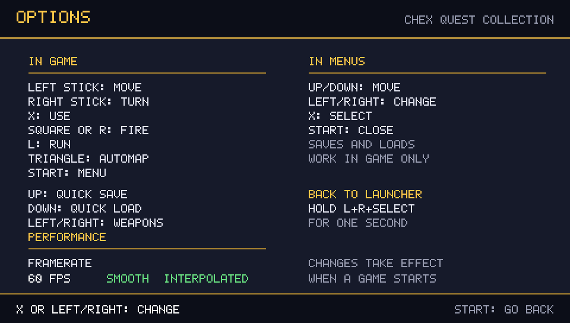

# Chex Quest Collection — PS Vita

One Vita app for **Chex Quest 1**, **Chex Quest 2** and **Chex Quest 3: Vanilla Edition**. Pick a game in the launcher and press **Cross** or **START** to play it.

The launcher is a proper menu now: it lists the three games plus a data-files row, shows at a glance which games are ready, plays menu music and blips, and can hand you the game data with a QR code if something is missing. Games run at **60 frames per second** with a smooth, interpolated view, and the old 35 fps pacing is still one press away in the options screen.

## Screenshots

| Launcher | Game data missing |
|---|---|
|  |  |

| Data files and QR code | Data screen, nothing installed yet |
|---|---|
|  |  |

| Options and controls | Return to launcher | Quick save |
|---|---|---|
|  |  |  |

## Download and install

Get [`ChexQuestCollection.vpk`](https://github.com/SancioPanza88/chex-quest-collection/releases/latest/download/ChexQuestCollection.vpk) from Releases and install it on a homebrew-enabled PS Vita/PSTV (VitaShell, or any VPK installer).

## Installation and game data

The VPK contains the launcher, **not** the game data. Copy your legally obtained files directly into `ux0:/data/chexquestcollection/`:

- `CHEX.WAD`
- `CHEX2.WAD`
- `chex3v.wad` and `chex3.deh`

**Important:** put all the files together in the `chexquestcollection` folder itself. Do **not** create subfolders (for example `chexquestcollection/chexquest/` or `chexquestcollection/chex3/`): the launcher will not find files placed inside subfolders.

Expected layout:

```
ux0:/data/chexquestcollection/
├── CHEX.WAD
├── CHEX2.WAD
├── chex3v.wad
└── chex3.deh
```

If files are missing, the launcher says so instead of failing:

- every game row shows **READY** or **MISSING**, and the header counts the installed games (`READY 2/3`);
- selecting the **DATA FILES** row (or pressing **Square**, or pressing **Cross** on a game that has no data yet) opens a screen with a **QR code** to download the data archive with your phone, a printable link, the folder to copy the files into, and a live checklist of the four files;
- when the launcher starts with no game data at all, it opens that data screen first;
- the status list is re-checked once per second, so files copied over FTP show up without restarting the app.

## PS Vita controls

The D-pad works in the Doom menus too, and every action is the same in all three games.

| In game | |
|---|---|
| Left stick | move |
| Right stick | turn |
| Cross | use |
| Square or R | fire |
| L | run |
| Triangle | automap |
| START | menu |
| D-pad Up | quick save |
| D-pad Down | quick load |
| D-pad Left/Right | cycle weapons (hold to repeat) |

| In menus | |
|---|---|
| D-pad Up/Down | move |
| D-pad Left/Right | change value |
| Cross | select |
| START | close |

Quick saves and loads confirm themselves with a short on-screen message ("QUICK SAVED", "QUICK LOADED", or "NO QUICK SAVE YET"). Saves and settings are kept separately for each game, under `ux0:/data/chexquestcollection/saves/<game>/` and `cfg/<game>/`.

To leave a game and go back to the launcher, **hold L + R + SELECT for one second**: a progress bar fills up and the app reloads into the launcher.

## Framerate

Games draw at **60 fps** by default. The simulation still runs on Doom's fixed 35 Hz timestep, so the frame you see is interpolated between the last two tics: movement and turning are continuous instead of stepping 35 times per second, at the cost of the picture being one tic (about 28 ms) behind the input. If you would rather have the most direct feel, open the **OPTIONS** screen with **SELECT** in the launcher and switch to **35 FPS (classic)**, which draws exactly one frame per tic like the original engine.

The choice is stored in `ux0:/data/chexquestcollection/settings.cfg` and applies the next time you start a game. The options screen also lists the full control mapping.

## Build

Install VitaSDK, then run:

```sh
cmake -S . -B build -DCMAKE_TOOLCHAIN_FILE="$VITASDK/share/vita.toolchain.cmake"
cmake --build build --parallel 1
```

The contract tests check the launcher and data contracts against the sources:

```sh
python -m unittest discover -s tests
```

Game data and third-party trademarks/artwork remain the property of their respective owners; this project does not distribute WAD or DEH files.
